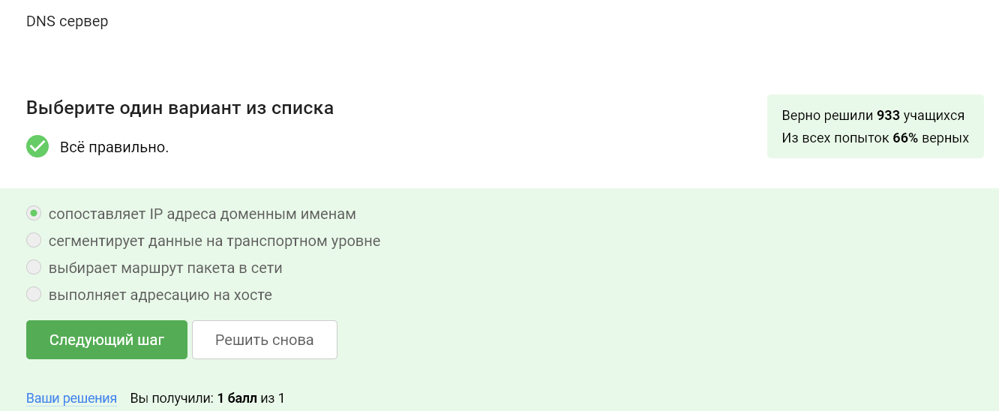

---
## Front matter
title: "Отчёт прохождения внешнего курса"
subtitle: "Безопасность в сети"
author: "Тарутина Кристина"

## Generic otions
lang: ru-RU
toc-title: "Содержание"

## Bibliography
bibliography: bib/cite.bib
csl: pandoc/csl/gost-r-7-0-5-2008-numeric.csl

## Pdf output format
toc: true # Table of contents
toc-depth: 2
lof: true # List of figures
lot: true # List of tables
fontsize: 12pt
linestretch: 1.5
papersize: a4
documentclass: scrreprt
## I18n polyglossia
polyglossia-lang:
  name: russian
  options:
	- spelling=modern
	- babelshorthands=true
polyglossia-otherlangs:
  name: english
## I18n babel
babel-lang: russian
babel-otherlangs: english
## Fonts
mainfont: PT Serif
romanfont: PT Serif
sansfont: PT Sans
monofont: PT Mono
mainfontoptions: Ligatures=TeX
romanfontoptions: Ligatures=TeX
sansfontoptions: Ligatures=TeX,Scale=MatchLowercase
monofontoptions: Scale=MatchLowercase,Scale=0.9
## Biblatex
biblatex: true
biblio-style: "gost-numeric"
biblatexoptions:
  - parentracker=true
  - backend=biber
  - hyperref=auto
  - language=auto
  - autolang=other*
  - citestyle=gost-numeric
## Pandoc-crossref LaTeX customization
figureTitle: "Рис."
tableTitle: "Таблица"
listingTitle: "Листинг"
lofTitle: "Список иллюстраций"
lotTitle: "Список таблиц"
lolTitle: "Листинги"
## Misc options
indent: true
header-includes:
  - \usepackage{indentfirst}
  - \usepackage{float} # keep figures where there are in the text
  - \floatplacement{figure}{H} # keep figures where there are in the text
---

# Цель работы

Провести контроль усвоения теоритического материала раздела "Безопасность в сети"

# Выполнение контрольных заданий

Протокол HTTP(S) является примером протокола прикладного уровня, по которому передаются веб-страницы. Об этом как раз говорилось в лекции. (рис. [-@fig:001]).

{#fig:001 width=70%}

На транспортном уровне существуют два основных протокола: TCP и UDP. TCP, в честь которого названа модель, обеспечивает надежную передачу пакетов данных. В отличие от него, UDP не гарантирует надежную доставку. Протокол TCP используется для передачи таких данных, как электронная почта или веб-страницы, где важна целостность информации.(рис. [-@fig:002]).

{#fig:002 width=70%}

IP-адреса представляют из себя числа от 0 до 255, разделённый точкой, так что выбираете те варианты, где числа находятся в данном диапазоне(рис. [-@fig:003]).

{#fig:003 width=70%}

В лекции говорилось, что: "основная задача этого DNS-сервера - это сопоставить название, то есть доменное имя, с корректным IP-адресом, с тем, где лежит этот сервер, этот сайт" (рис. [-@fig:004]).

{#fig:004 width=70%}

Всё начинается с прикладного уровня, предоставляющего доступ для пользовательских программ к службам интернета, после чего переходит на транспортный. Там происходит адресация и передача данных. Потом мы переходим на сетевой уровень, где вычисляем возможность доставки данных и они передаются между физичскими сетями. И уже потом идёт канальный уровень(рис. [-@fig:005]).

{#fig:005 width=70%}

Он предполагает передачу данных между клиентом и сервером в открытом виде, а вот HTTPS в зашифрованном. ДОполнительная буква s как бы даже намекает нам на это(рис. [-@fig:006]).

{#fig:006 width=70%}

Из двух фактов. СНачала происходит процесс "рукопожатия", а уже потом пердачи данных.(рис. [-@fig:007]).

{#fig:007 width=70%}

ВЕрсия протокола определяется не только клиентом, она также определяется сервером, как бы с двух сторон одновременно(рис. [-@fig:008]).

{#fig:008 width=70%}

Шифрования данных. Оно происходит позже, а вот все подготовительные этапы, выбор алгоритмов, формирование секретного ключа как раз происходят в фазе рукопожатия(рис. [-@fig:009]).

{#fig:009 width=70%}

Куки хранят индентификатор пользователя и id сессии, но они никога, ни в коем случае не будут хранить пароля пользователя. Это не только нецелесообразно, но и попросту опасно(рис. [-@fig:010]).

{#fig:010 width=70%}

Для улучшения надежности соединения, для всего остального они используются. ДАже наша персонализирующая реклама, удивляющая многих не сведущих в этой теме пользователей, существует благодаря куки(рис. [-@fig:011]).

{#fig:011 width=70%}

Куки генерируются сервером, они не могут быть созданы клиентом(рис. [-@fig:012]).

{#fig:012 width=70%}

Да, на время пользования веб-сайтом. Если, допустим, закрыть вкладку, то содержимое корзины в каком-нибудь онлайн магазине, использующим сессионные куки, пропадёт(рис. [-@fig:013]).

{#fig:013 width=70%}

Промежуточных узлов три. Два узла не гарантируют анонимизации, а 4 уже избыточно и не добавляет никакой эффективности(рис. [-@fig:014]).

{#fig:014 width=70%}

Известен отправителю и выходному узлу. Ни охранный, ни промежуточный его не знают.(рис. [-@fig:015]).

{#fig:015 width=70%}

С охранным, выходным и промежуточным узлом. Причём с промежуточным и выходным узлом он генерирует ключ с помощью охранного узла(рис. [-@fig:016]).

{#fig:016 width=70%}

Конечно нет. С этим могут справиться и другие браузеры.(рис. [-@fig:017]).

{#fig:017 width=70%}

В общем, WiFi – это технология беспроводной локальной сети, которая базируется на стандарте IEEE 802.11. IEEE представляет собой организацию, которая устанавливает стандарты для работы сети Интернет. Она определяет принципы функционирования беспроводного интернета, начиная с номера стандарта 802.11, и все последующие модификации этого стандарта носят аналогичное обозначение, за которым следуют дополнительные буквы.(рис. [-@fig:018]).

{#fig:018 width=70%}

На канальном уровне. В том числе канальный уровень обеспечивает помехоустойчивость(рис. [-@fig:019]).

{#fig:019 width=70%}

Это WEP. А вот остальные методы вполне безопасны(рис. [-@fig:020]).

{#fig:020 width=70%}

Передаются в зашифрованном виде только после аутентификации устройств. Это обеспечивает защиту данных, иначе бы их могли украсть(рис. [-@fig:021]).

{#fig:021 width=70%}

НУ здесь можно догадаться даже не изучая курс, только по самим названиям. Хотя конечно об этом говорилось и в лекции.(рис. [-@fig:022]).

{#fig:022 width=70%}

# Выводы

Мы успешно прошли контроль усвоения теоритического материала раздела "Безопасность в сети"

# Список литературы{.unnumbered}

::: {#refs}
:::
