---
## Front matter
title: "Отчёт прохождения внешнего курса"
subtitle: "Защита ПК/Телефона"
author: "Тарутина Кристина"

## Generic otions
lang: ru-RU
toc-title: "Содержание"

## Bibliography
bibliography: bib/cite.bib
csl: pandoc/csl/gost-r-7-0-5-2008-numeric.csl

## Pdf output format
toc: true # Table of contents
toc-depth: 2
lof: true # List of figures
lot: true # List of tables
fontsize: 12pt
linestretch: 1.5
papersize: a4
documentclass: scrreprt
## I18n polyglossia
polyglossia-lang:
  name: russian
  options:
	- spelling=modern
	- babelshorthands=true
polyglossia-otherlangs:
  name: english
## I18n babel
babel-lang: russian
babel-otherlangs: english
## Fonts
mainfont: PT Serif
romanfont: PT Serif
sansfont: PT Sans
monofont: PT Mono
mainfontoptions: Ligatures=TeX
romanfontoptions: Ligatures=TeX
sansfontoptions: Ligatures=TeX,Scale=MatchLowercase
monofontoptions: Scale=MatchLowercase,Scale=0.9
## Biblatex
biblatex: true
biblio-style: "gost-numeric"
biblatexoptions:
  - parentracker=true
  - backend=biber
  - hyperref=auto
  - language=auto
  - autolang=other*
  - citestyle=gost-numeric
## Pandoc-crossref LaTeX customization
figureTitle: "Рис."
tableTitle: "Таблица"
listingTitle: "Листинг"
lofTitle: "Список иллюстраций"
lotTitle: "Список таблиц"
lolTitle: "Листинги"
## Misc options
indent: true
header-includes:
  - \usepackage{indentfirst}
  - \usepackage{float} # keep figures where there are in the text
  - \floatplacement{figure}{H} # keep figures where there are in the text
---

# Цель работы

Провести контроль усвоения теоритического материала раздела "Защита ПК/Телефона"

# Выполнение контрольных заданий

Да, конечно, и не только его. ЗАшифровать также можно, например, весь жёсткий диск или его сегмент(рис. [-@fig:001]).

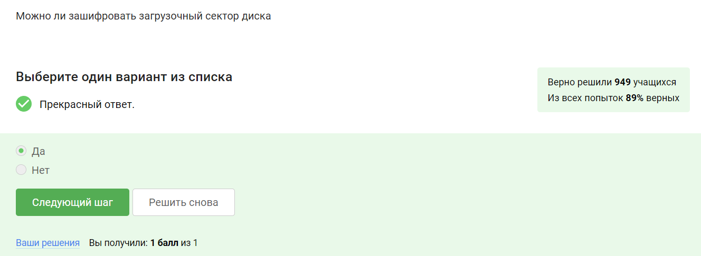{#fig:001 width=70%}

Шифрование больших объемов данных, таких как жесткий диск или его сегменты, а также крупные флешки, обычно выполняется с использованием симметричного шифрования, чаще всего алгоритма AES. Этот алгоритм является американским стандартом симметричного шифрования и широко применяется для защиты конфиденциальной информации при передаче по сети. AES - это эффективный алгоритм, который может быть реализован на аппаратном уровне, что обеспечивает высокую скорость шифрования и дешифрования. Благодаря своей производительности пользователь практически не замечает задержек в работе, поскольку операции шифрования и дешифрования выполняются быстро. (рис. [-@fig:002]).

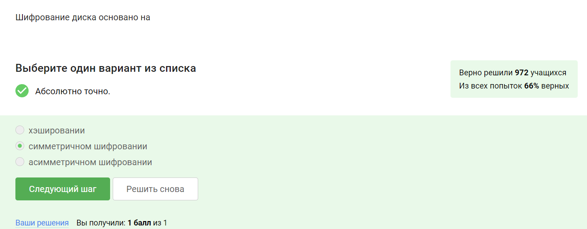{#fig:002 width=70%}

BitLocker - это утилита системы Windows, а VeraCrypt - бесплатная прогламма (рис. [-@fig:003]).

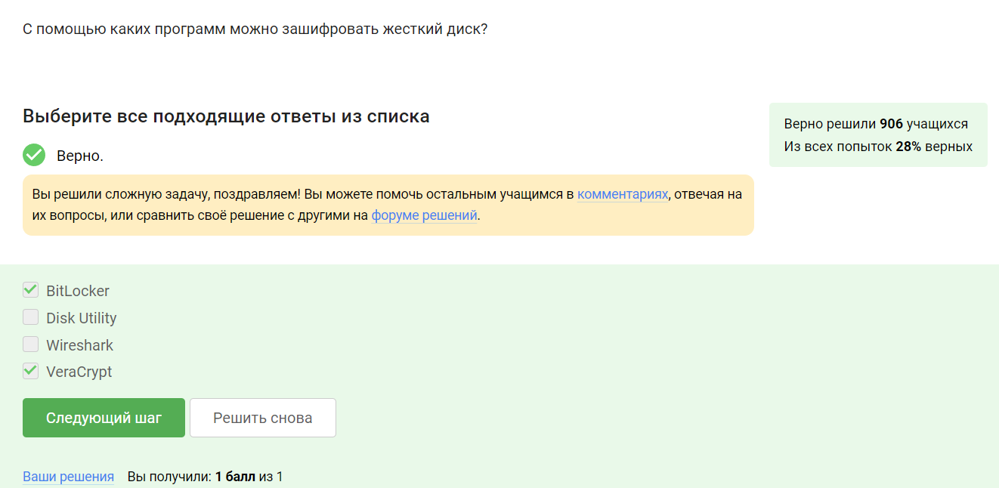{#fig:003 width=70%}

Стойкие пароли это те, которые невозможно перебрать. Среди данных нам вариантов к стойким относится только один.(рис. [-@fig:004]).

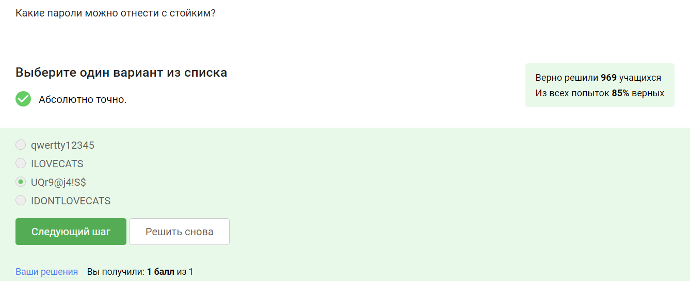{#fig:004 width=70%}

В менеджерах паролях. Все остальные варианты даже в рамках здравого смысла звучат абсурдно, а подобные менеджеры специализуются на хранении и хорошо защищены(рис. [-@fig:005]).

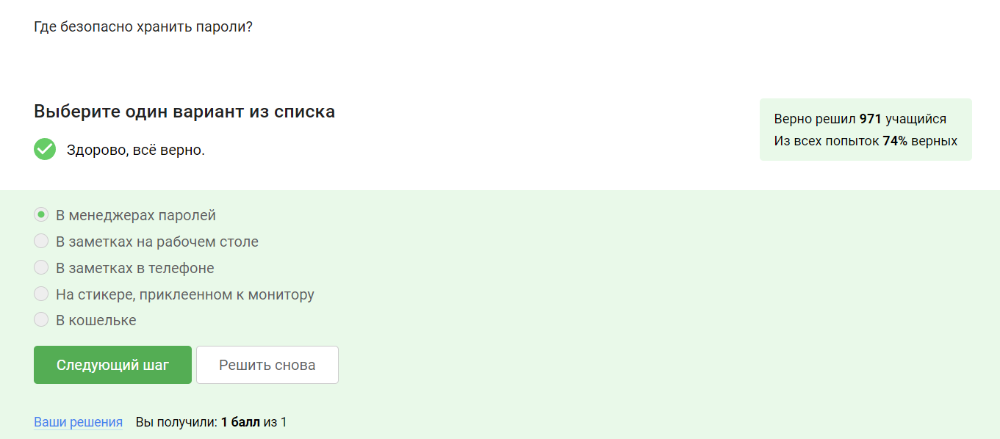{#fig:005 width=70%}

Для защиты от автоматизированных атак. Она призвана распознавать ботов, но некоторые из них уже натренированы решать капчу, а ещ есть сайты, где капчу за копейки решают люди.(рис. [-@fig:006]).

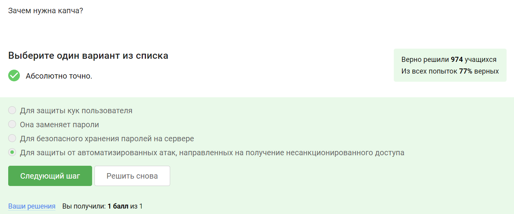{#fig:006 width=70%}

Чтобы не хранить пароли на сервере в открытом виде. ЭТо позволяет повысить безопасность.(рис. [-@fig:007]).

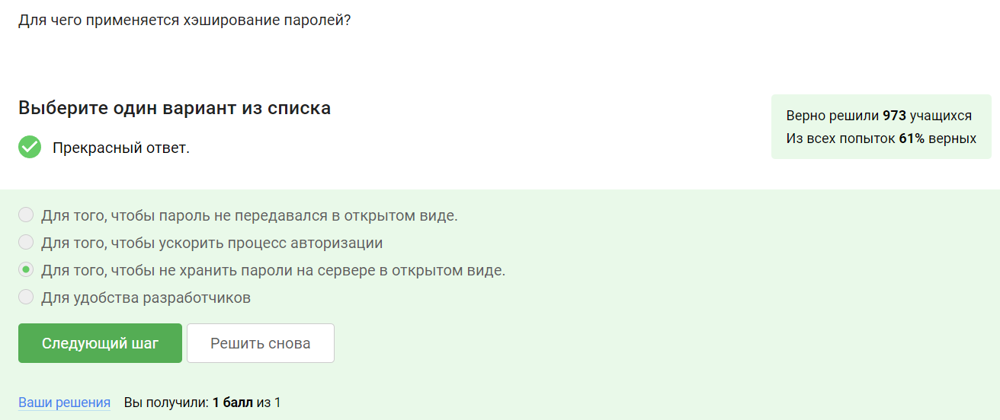{#fig:007 width=70%}

Конечно нет. У него уже есть доступ к серверу, а значит и данные о самой соли(рис. [-@fig:008]).

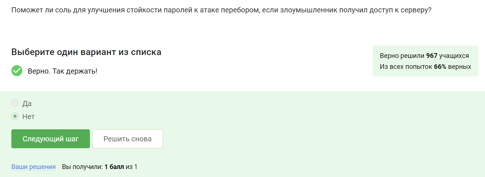{#fig:008 width=70%}

ЭТо задание с маленьким подвохом. Здесь верны все ответы. ИХ комплекс может лучше всего обезопасить нас от подобного рода утечек данных(рис. [-@fig:009]).

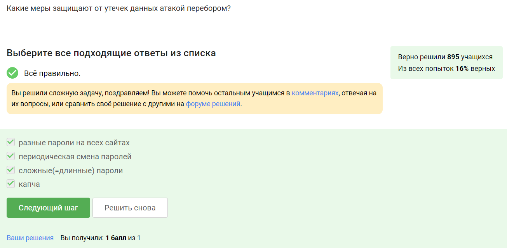{#fig:009 width=70%}

Страница входа в Google не является фишинговой, это просто бразильская страница. Отсюда и такое странное сочетание букв. Страница маил ру тоже правильная (рис. [-@fig:010]).

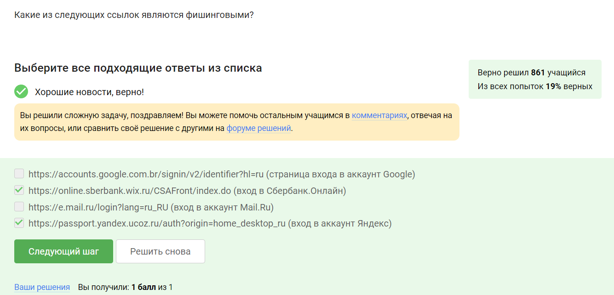{#fig:010 width=70%}

Конечно может. МОжет быть так, что это очень похожий имеил, например не Alan@mail.ru, а Alam@mail.ru. Чем длиньше название, тем сложнее заметить. Но и простой взлом аккаунта никто не отменял(рис. [-@fig:011]).

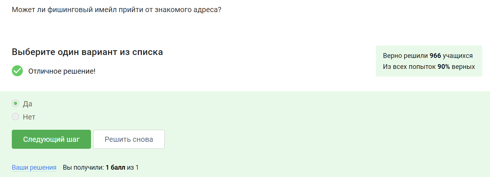{#fig:011 width=70%}

Это подмена адреса отправителя в имейлах. Такого рода атаки нанесли крупные финанские потери компаниям в своё время(рис. [-@fig:012]).

{#fig:012 width=70%}

Ну, здесь можно вспомнить всем известного троянского коня и даже так догадаться. Конечно он маскируется под легитимную систему(рис. [-@fig:013]).

{#fig:013 width=70%}

При генераци первого сообщения стороной отправителем. В ином случае это либо было бы небезопасно, либо, если при каждом сообщении, попросту избыточно(рис. [-@fig:014]).

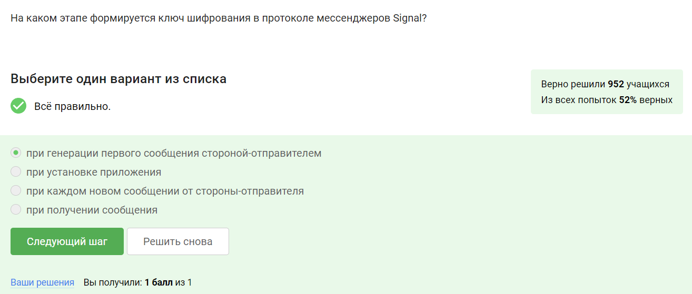{#fig:014 width=70%}

СОобщения передаются в зашифрованном виде. Это довольно хороший способ передачи данных (рис. [-@fig:015]).

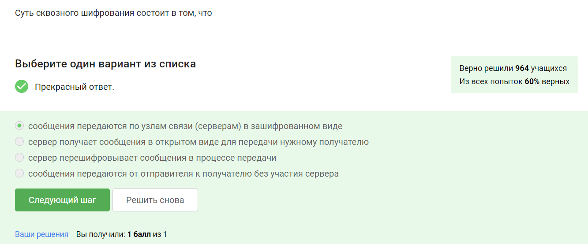{#fig:015 width=70%}

# Выводы

Мы успешно прошли контроль усвоения теоритического материала раздела "Защита ПК/Телефона"

# Список литературы{.unnumbered}

::: {#refs}
:::
