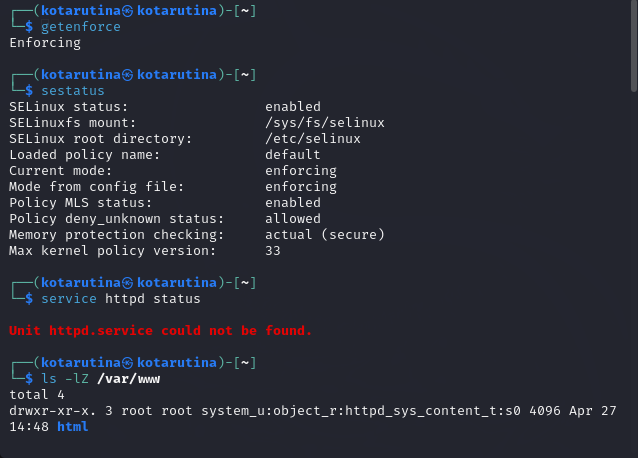
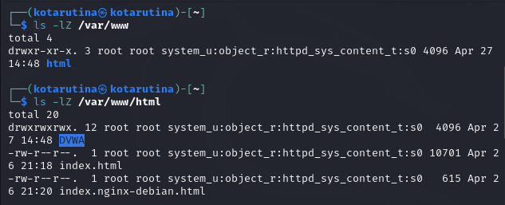
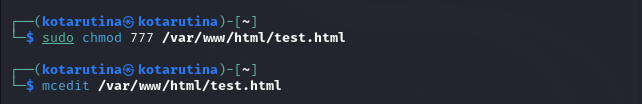
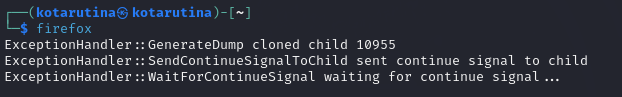
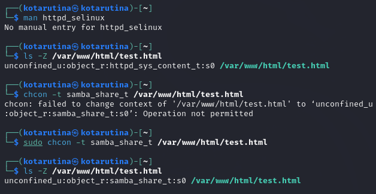

---
## Front matter
lang: ru-RU
title: Мандатное разграничение прав в Linux
subtitle: Лабораторная работа №6
author:
  - Тарутина К.О.
institute:
  - Российский университет дружбы народов, Москва, Россия
date: 27 апреля 2024

## i18n babel
babel-lang: russian
babel-otherlangs: english

## Formatting pdf
toc: false
toc-title: Содержание
slide_level: 2
aspectratio: 169
section-titles: true
theme: metropolis
header-includes:
 - \metroset{progressbar=frametitle,sectionpage=progressbar,numbering=fraction}
 - '\makeatletter'
 - '\beamer@ignorenonframefalse'
 - '\makeatother'
---

# Информация

# Вводная часть

## Цели и задачи

- Развить навыки администрирования ОС Linux. Получить первое практическое знакомство с технологией SELinux

- Проверить работу SELinx на практике совместно с веб-сервером
Apache.

# Ход лабораторной работы

## Проверка SELinux

## Тип файлов

## Создание файла

## Ошибка firefox

## Изменение контекста файла

## Результаты

- Мы успешно развили навыки администрирования ОС Linux. Получить первое практическое знакомство с технологией SELinux

- Проверили работу SELinx на практике совместно с веб-сервером
Apache.

