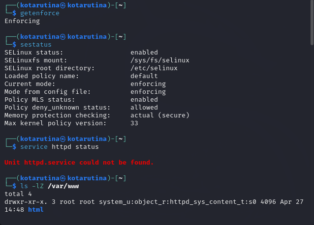
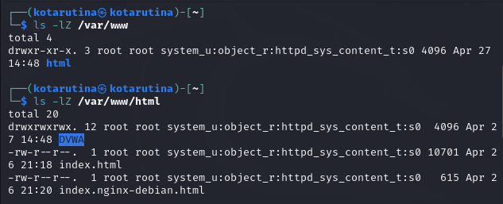
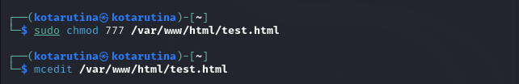
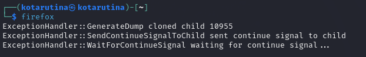
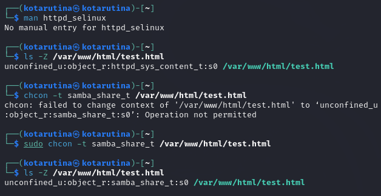
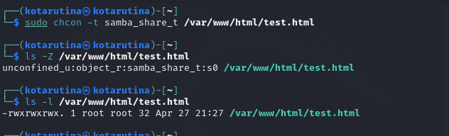
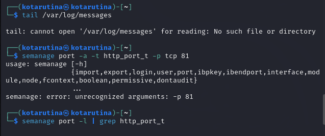
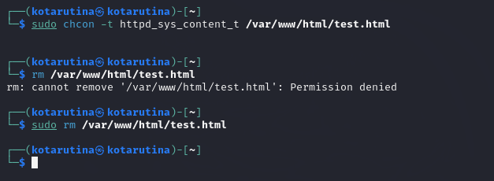

---
## Front matter
title: "Мандатное разграничение прав в Linux"
subtitle: "Лабораторная работа №6"
author: "Тарутина Кристина Олеговна"

## Generic otions
lang: ru-RU
toc-title: "Содержание"

## Bibliography
bibliography: bib/cite.bib
csl: pandoc/csl/gost-r-7-0-5-2008-numeric.csl

## Pdf output format
toc: true # Table of contents
toc-depth: 2
lof: true # List of figures
lot: true # List of tables
fontsize: 12pt
linestretch: 1.5
papersize: a4
documentclass: scrreprt
## I18n polyglossia
polyglossia-lang:
  name: russian
  options:
	- spelling=modern
	- babelshorthands=true
polyglossia-otherlangs:
  name: english
## I18n babel
babel-lang: russian
babel-otherlangs: english
## Fonts
mainfont: PT Serif
romanfont: PT Serif
sansfont: PT Sans
monofont: PT Mono
mainfontoptions: Ligatures=TeX
romanfontoptions: Ligatures=TeX
sansfontoptions: Ligatures=TeX,Scale=MatchLowercase
monofontoptions: Scale=MatchLowercase,Scale=0.9
## Biblatex
biblatex: true
biblio-style: "gost-numeric"
biblatexoptions:
  - parentracker=true
  - backend=biber
  - hyperref=auto
  - language=auto
  - autolang=other*
  - citestyle=gost-numeric
## Pandoc-crossref LaTeX customization
figureTitle: "Рис."
tableTitle: "Таблица"
listingTitle: "Листинг"
lofTitle: "Список иллюстраций"
lotTitle: "Список таблиц"
lolTitle: "Листинги"
## Misc options
indent: true
header-includes:
  - \usepackage{indentfirst}
  - \usepackage{float} # keep figures where there are in the text
  - \floatplacement{figure}{H} # keep figures where there are in the text
---

# Цель работы

Развить навыки администрирования ОС Linux. Получить первое практическое знакомство с технологией SELinux

Проверить работу SELinx на практике совместно с веб-сервером
Apache.

# Выполнение лабораторной работы

Войдите в систему с полученными учётными данными и убедитесь, что
SELinux работает в режиме enforcing политики targeted с помощью команд getenforce и sestatus.
Обратитесь с помощью браузера к веб-серверу, запущенному на вашем
компьютере, и убедитесь, что последний работает:
service httpd status
Определите тип файлов и поддиректорий, находящихся в директории
/var/www, с помощью команды
ls -lZ /var/www

(рис. [-@fig:001]).

{#fig:001 width=70%}

Определите тип файлов, находящихся в директории /var/www/html:
ls -lZ /var/www/html
Определите круг пользователей, которым разрешено создание файлов в
директории /var/www/html
(рис. [-@fig:002]).

{#fig:002 width=70%}

Создайте от имени суперпользователя (так как в дистрибутиве после установки только ему разрешена запись в директорию) html-файл
/var/www/html/test.html следующего содержания:
<html>
<body>test</body>
</html>
(рис. [-@fig:003]).

{#fig:003 width=70%}

Обратитесь к файлу через веб-сервер, введя в браузере адрес
http://127.0.0.1/test.html. Убедитесь, что файл был успешно отображён
Тут, к сожалению, по какой-то причине у меня отказался запускаться firefox
(рис. [-@fig:004]).

{#fig:004 width=70%}

Изучите справку man httpd_selinux и выясните, какие контексты файлов определены для httpd. Сопоставьте их с типом файла
test.html. Проверить контекст файла можно командой ls -Z.
ls -Z /var/www/html/test.html
Измените контекст файла /var/www/html/test.html с
httpd_sys_content_t на любой другой, к которому процесс httpd не
должен иметь доступа, например, на samba_share_t:
chcon -t samba_share_t /var/www/html/test.html
ls -Z /var/www/html/test.html
(рис. [-@fig:005]).

{#fig:005 width=70%}

Проанализируйте ситуацию. Почему файл не был отображён, если права
доступа позволяют читать этот файл любому пользователю?
ls -l /var/www/html/test.html
Просмотрите log-файлы веб-сервера Apache. Также просмотрите системный лог-файл:
tail /var/log/messages
Если в системе окажутся запущенными процессы setroubleshootd и
audtd, то вы также сможете увидеть ошибки, аналогичные указанным
выше, в файле /var/log/audit/audit.log. Проверьте это утверждение самостоятельно.
(рис. [-@fig:006]).

{#fig:006 width=70%}

Проанализируйте лог-файлы:
tail -nl /var/log/messages
Просмотрите файлы /var/log/http/error_log,
/var/log/http/access_log и /var/log/audit/audit.log и
выясните, в каких файлах появились записи.
Выполните команду
semanage port -a -t http_port_t -р tcp 81
После этого проверьте список портов командой
semanage port -l | grep http_port_t
Убедитесь, что порт 81 появился в списке.
Попробуйте запустить веб-сервер Apache ещё
(рис. [-@fig:007]).

{#fig:007 width=70%}

Верните контекст httpd_sys_cоntent__t к файлу /var/www/html/ test.html:
chcon -t httpd_sys_content_t /var/www/html/test.html
После этого попробуйте получить доступ к файлу через веб-сервер, введя в браузере адрес http://127.0.0.1:81/test.html.
Вы должны увидеть содержимое файла — слово «test».
Исправьте обратно конфигурационный файл apache, вернув Listen 80.
Удалите привязку http_port_t к 81 порту:
semanage port -d -t http_port_t -p tcp 81
и проверьте, что порт 81 удалён.
Удалите файл /var/www/html/test.html:
rm /var/www/html/test.html
(рис. [-@fig:008]).

{#fig:008 width=70%}

# Выводы

Мы успешно развили навыки администрирования ОС Linux. Получить первое практическое знакомство с технологией SELinux

Проверили работу SELinx на практике совместно с веб-сервером
Apache.

# Список литературы{.unnumbered}

::: {#refs}
:::
