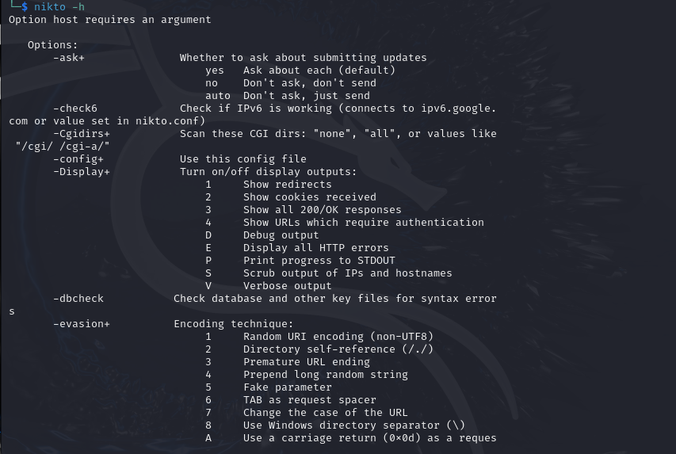
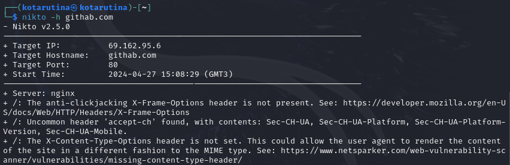
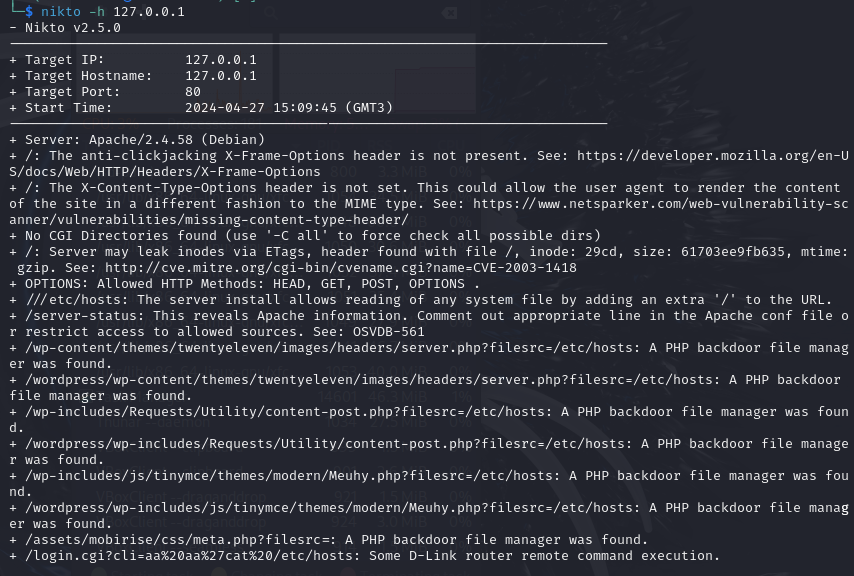

---
## Front matter
lang: ru-RU
title: Четвёртый этап проекта
subtitle: Nikto
author:
  - Тарутина К.О.
institute:
  - Российский университет дружбы народов, Москва, Россия
date: 27 апреля 2024

## i18n babel
babel-lang: russian
babel-otherlangs: english

## Formatting pdf
toc: false
toc-title: Содержание
slide_level: 2
aspectratio: 169
section-titles: true
theme: metropolis
header-includes:
 - \metroset{progressbar=frametitle,sectionpage=progressbar,numbering=fraction}
 - '\makeatletter'
 - '\beamer@ignorenonframefalse'
 - '\makeatother'
---

# Информация

# Вводная часть

## Актуальность

- nikto — базовый сканер безопасности веб-сервера. Он сканирует и обнаруживает уязвимости в веб-приложениях, обычно вызванные неправильной конфигурацией на самом сервере, файлами, установленными по умолчанию, и небезопасными файлами, а также устаревшими серверными приложениями.

## Цели и задачи

- Изучить процесс работы с nikto

# Ход лабораторной работы

## Спрвка

## РЕзультаты для github.com

## Результаты для локаьной сети

## Выводы

::: incremental

- Мы изучили процесс работы с nikto

:::

